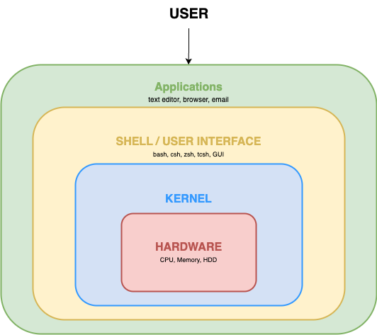
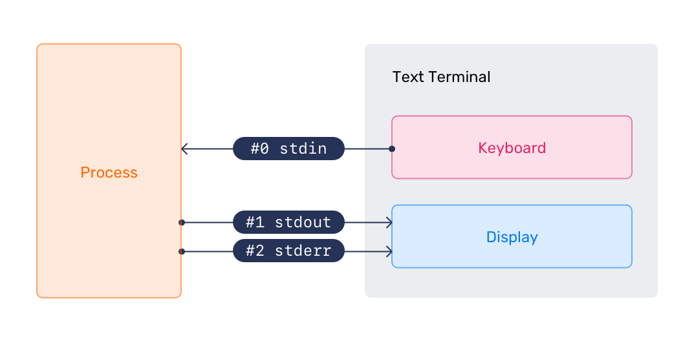

# 2. CLI Environment

!!! abstract
    Define the shell, use CLI commands and help, work with variables and streams, chain commands, and edit files with nano.

The shell is a command-language interpreter for interacting with the operating system. It receives typed commands and sends them to the operating system for execution. Ubuntu Server installs `bash` and `dash` by default; `bash` is the default shell. System scripts declare the shell they use.

- `bash`: Bourne Again Shell
- `dash`: Debian Almquist Shell

The user's default shell is defined in `/etc/passwd`. The distribution-agnostic command-line interface (CLI) provides more control and options than a graphical user interface. A terminal emulator provides access to the shell and normally displays a prompt containing the username, host name, and a dollar sign.



Commands can be executable programs, shell built-ins such as `cd`, shell functions, or aliases. Terminal text can be copied with the mouse by highlighting it, then using the middle mouse button or the paste option in the terminal.

## :material-book-open-page-variant-outline: 2.1 Secure Shell

Secure Shell (SSH) connects to remote computers and allows interactive program execution. SSH is the common method for secure remote Linux-server access: it encrypts the session and supports authentication, allowing one PC to manage multiple computers.

Use `ssh remote_host` when the remote username matches the local user, or `ssh user@remote_host` when it differs. Use `exit` to end an SSH session. To run a command remotely, use `ssh remote_host command_to_run`. These are generic connection forms, not executable lab commands.

## :material-book-open-page-variant-outline: 2.2 CLI Commands

Common CLI commands can also be used in scripts to automate tasks.

**Navigating the filesystem:** `cd` changes directory, `ls` lists files, `mkdir` creates a directory, `pwd` prints the working directory, and `rmdir` removes a directory.

**Manipulating the filesystem:** `chgrp` changes group ownership, `chmod` changes file mode bits, `chown` changes file owner and group, `df` reports filesystem space use, and `du` estimates file space use.

**Searching the filesystem:** `find` searches for files matching a pattern, `locate` finds files by name, and `which` locates a command.

**Searching file contents:** `file` determines file type, `grep` prints matching lines, and `less` and `more` view content.

**Manipulating file contents:** `cp` copies, `ln` creates a symbolic link, `mv` moves or renames, `rm` removes, and `touch` changes timestamps.

**Text processing:** `cat` concatenates files, `gawk` scans and processes patterns, `head` displays the first part of output, `tail` displays the last part, and `tee` writes input to standard output and a file.

### :material-application-edit-outline: 2.2.1 CLI Commands Lab

1. Use `man` to identify four `ls` options.

```bash
# Open the ls manual page
man ls
```
??? example "Expected result"
    ```shell
    NAME
            ls - list directory contents
    SYNOPSIS
            ls [OPTION]... [FILE]...
    DESCRIPTION
            List information about the FILEs (the current directory by default).  Sort entries alphabetically if none of -cftuvSUX nor --sort is specified.
            Mandatory arguments to long options are mandatory for short options too.
            -a, --all
                   do not ignore entries starting with .
            -A, --almost-all
                   do not list implied . and ..
    ```

    First-screen pager excerpt; the header line and text wrapping vary with terminal width. Browse the option list under `DESCRIPTION` for `-a`, `-h`, `-l`, and `-t`, then press `q` to exit.

`-a, --all` includes entries beginning with `.`, `-h, --human-readable` prints readable sizes with `-l` or `-s`, `-l` uses long format, and `-t` sorts by newest modification time first.

2. Create `mydir1`, enter it, create and enter `mydir2`, return to its parent, then remove `mydir2`.

```bash
# Create mydir1
mkdir mydir1
```
??? example "Expected result"
    No output.

```bash
# Enter mydir1
cd mydir1
```
??? example "Expected result"
    No output.

```bash
# Create mydir2
mkdir mydir2
```
??? example "Expected result"
    No output.

```bash
# Enter mydir2
cd mydir2
```
??? example "Expected result"
    No output.

```bash
# Return to the parent of mydir2
cd ..
```
??? example "Expected result"
    No output.

```bash
# Remove the empty mydir2 directory
rmdir mydir2
```
??? example "Expected result"
    No output.

3. Create `file1`, copy it to `file2`, return to the parent of `mydir1`, create `mynewdir`, and copy `mydir1` contents into it.

```bash
# Create file1
touch file1
```
??? example "Expected result"
    No output.

```bash
# Copy file1 to file2
cp file1 file2
```
??? example "Expected result"
    No output.

```bash
# Return to the parent directory
cd ..
```
??? example "Expected result"
    No output.

```bash
# Create mynewdir
mkdir mynewdir
```
??? example "Expected result"
    No output.

```bash
# Copy mydir1 contents into mynewdir
cp -a mydir1/* mynewdir
```
??? example "Expected result"
    No output.

4. Type `ls my` and press Tab twice to inspect shell completion choices. The partial command is canceled after completion rather than invoked.

```bash
# Type this text, then press Tab twice
ls my<Tab><Tab>
```
??? example "Expected result"
    ```shell
    mydir1/   mynewdir/
    ubuntu@ubuntu:~$ ls my
    ```

    The shell lists the two matching directories and redisplays the partially entered command; list spacing varies with terminal width. The command line is then canceled without being executed.

> End of the lab. Do not continue to the next topic.

## :material-book-open-page-variant-outline: 2.3 Getting Help

`man` is the system manual pager. Its argument identifies a program, utility, or function page. A page can occur in multiple sections; by default, the first matching section in a predefined order is displayed. `man man` documents sections, display options, exit status, environment variables, and the `SEE ALSO` section.

Manual-page sections are: 1 executable programs or shell commands; 2 system calls; 3 library calls; 4 special files, usually in `/dev`; 5 file formats and conventions; 6 games; 7 miscellaneous material; 8 system-administration commands; and 9 non-standard kernel routines.

Use Enter for one line down, Space for one page down, `g` for the top, `G` for the bottom, `h` or `H` for help, `q` to quit, or arrow keys to move through a manual page.

### :material-application-edit-outline: 2.3.1 Getting Help Lab

At the prompt, try `man`, then `man man`; scroll through the page, use the listed navigation commands, and press `h` while viewing a page.

```bash
# Run man without a page argument
man
```

This reference-only form prints a usage prompt rather than opening a manual page.

```bash
# Open the man manual page
man man
```
??? example "Expected result"
    ```shell
    man: can't resolve man7/groff_man.7
    NAME
            man - an interface to the system reference manuals
    SYNOPSIS
            man [man options] [[section] page ...] ...
            man -k [apropos options] regexp ...
            man -K [man options] [section] term ...
            man -f [whatis options] page ...
            man -l [man options] file ...
            man -w|-W [man options] page ...
    ```

    The `can't resolve` line is an informational warning; the manual page then opens normally.

```bash
# Open the ls manual page
man ls
```
??? example "Expected result"
    ```shell
    NAME
            ls - list directory contents
    SYNOPSIS
            ls [OPTION]... [FILE]...
    DESCRIPTION
            List information about the FILEs (the current directory by default).  Sort entries alphabetically if none of -cftuvSUX nor --sort is specified.
            Mandatory arguments to long options are mandatory for short options too.
            -a, --all
                   do not ignore entries starting with .
            -A, --almost-all
                   do not list implied . and ..
    ```

    First-screen pager excerpt; the header line and text wrapping vary with terminal width. Press `q` to exit.

Then search for the `rsync -p` option. The `rsync` manual page does not document a `-p` option.

```bash
# Open the rsync manual page
man rsync
```
??? example "Expected result"
    ```shell
    NAME
            rsync - a fast, versatile, remote (and local) file-copying tool
    SYNOPSIS
            Local:
                rsync [OPTION...] SRC... [DEST]
            Access via remote shell:
                Pull:
                    rsync [OPTION...] [USER@]HOST:SRC... [DEST]
    ```

> End of the lab. Do not continue to the next topic.

## :material-book-open-page-variant-outline: 2.4 Shell Environment Variables

A shell environment variable is a named character string that stores information such as numbers, text, filenames, devices, or credentials. `PATH` tells the shell which directories to search for executable files. Use `env` or `printenv` to list defined environment variables. Common variables are `SHELL` for the default shell, `USER` for the logged-in user, `PWD` for the current directory, and `HOME` for the current user's home directory.

To run a command outside `PATH`, precede it with a relative or full path, such as `. /mycommand.sh` or `/home/myuser/mycommand.sh`. Replace the example paths with a known script before running either form.

### :material-application-edit-outline: Naming Variables

By convention, variable names are uppercase. They can use letters, numbers, and underscores, but cannot begin with a number.

```bash
# Export a terminal-type variable
export TERM=xterm-256color
```
??? example "Expected result"
    No output.

### :material-application-edit-outline: Setting and Unsetting Variables

Define variables with `name=value`; they are local until the shell exits. Use `unset` or an empty value to undefine them. Use `export` to make a variable available to child processes.

```bash
# Set local variables
NAME=Marvin
```
??? example "Expected result"
    No output.

```bash
# Set a variable containing multiple values
NAMES="Marvin Ford Arthur Trillian"
```
??? example "Expected result"
    No output.

```bash
# Unset NAME
unset NAME
```
??? example "Expected result"
    No output.

```bash
# Set NAME to an empty value
NAME=
```
??? example "Expected result"
    No output.

```bash
# Export NAME to child processes
export NAME=Marvin
```
??? example "Expected result"
    No output.

### :material-application-edit-outline: Manipulating Variables

```bash
# Display NAME
echo $NAME
```
??? example "Expected result"
    ```shell
    Marvin
    ```

```bash
# Append a value to NAMES
NAMES="$NAMES Zaphod"
```
??? example "Expected result"
    No output.

```bash
# Mark NAMES as read-only
readonly NAMES
```
??? example "Expected result"
    No output.

### :material-application-edit-outline: Special Variables

Special variables can be referenced but not assigned. `$?` is the exit status of the last command, `$$` is the PID of the current shell, and `$!` is the PID of the last background command. Use them as part of another command, for example `echo $?`; entering a parameter token alone makes the expanded value a command name.

### :material-application-edit-outline: 2.4.1 Shell Environment and Variables Lab

1. View `PATH` and environment variables.

```bash
# Display the PATH variable
echo $PATH
```
??? example "Expected result"
    ```shell
    /usr/local/sbin:/usr/local/bin:/usr/sbin:/usr/bin:/sbin:/bin:/usr/games:/usr/local/games:/snap/bin
    ```

    `PATH` differs by system and session.

```bash
# List environment variables
env
```
??? example "Expected result"
    ```shell
    SHELL=/bin/bash
    LC_ADDRESS=C.UTF-8
    LC_NAME=C.UTF-8
    LC_MONETARY=C.UTF-8
    NAME=Marvin
    PWD=/home/ubuntu
    LOGNAME=ubuntu
    XDG_SESSION_TYPE=tty
    HOME=/home/ubuntu
    LC_PAPER=C.UTF-8
    LANG=C.UTF-8
    ```

    Contiguous excerpt from the leading entries; the full list continues with variables such as `LS_COLORS`, `PATH`, `TERM`, and `USER`. Entries, order, and locale values vary by session, login method, and prior exports; the shown `NAME=Marvin` comes from the earlier `export` command, and `SSH_*` connection entries differ for every session.

2. Consider the purpose of `SHELL`. Set and view `MYNAME`.

```bash
# Set MYNAME
MYNAME="john"
```
??? example "Expected result"
    No output.

```bash
# Display MYNAME
echo $MYNAME
```
??? example "Expected result"
    ```shell
    john
    ```

3. Set `PART1` and `PART2`, then display both.

```bash
# Set the first name fragment
PART1="My name is"
```
??? example "Expected result"
    No output.

```bash
# Set the second name fragment
PART2="john"
```
??? example "Expected result"
    No output.

```bash
# Display the first fragment
echo $PART1
```
??? example "Expected result"
    ```shell
    My name is
    ```

```bash
# Display the second fragment
echo $PART2
```
??? example "Expected result"
    ```shell
    john
    ```

4. Combine the variables into `STUDENTNAME` and display it.

```bash
# Combine the name fragments
STUDENTNAME=$PART1$PART2
```
??? example "Expected result"
    No output.

```bash
# Display STUDENTNAME
echo $STUDENTNAME
```
??? example "Expected result"
    ```shell
    My name isjohn
    ```

    The fragments are concatenated exactly as stored; the assignment contains no separator between them.

5. Undefine the variables, then confirm they are empty.

```bash
# Unset PART1
unset PART1
```
??? example "Expected result"
    No output.

```bash
# Unset PART2
unset PART2
```
??? example "Expected result"
    No output.

```bash
# Unset STUDENTNAME
unset STUDENTNAME
```
??? example "Expected result"
    No output.

```bash
# Confirm PART1 is undefined
echo $PART1
```
??? example "Expected result"
    ```shell

    ```

    `PART1` is undefined, so `echo` prints an empty line.

```bash
# Confirm PART2 is undefined
echo $PART2
```
??? example "Expected result"
    ```shell

    ```

    `PART2` is undefined, so `echo` prints an empty line.

```bash
# Confirm STUDENTNAME is undefined
echo $STUDENTNAME
```
??? example "Expected result"
    ```shell

    ```

    `STUDENTNAME` is undefined, so `echo` prints an empty line.

6. Set an unexported variable, create a subshell, and inspect it.

```bash
# Set x in the current shell
x=5
```
??? example "Expected result"
    No output.

```bash
# Display x in the current shell
echo $x
```
??? example "Expected result"
    ```shell
    5
    ```

```bash
# Create a subshell
bash
```
??? example "Expected result"
    ```shell
    ubuntu@ubuntu:~$
    ```

    A new interactive `bash` subshell starts and shows its own prompt.

```bash
# Display x in the subshell
echo $x
```
??? example "Expected result"
    ```shell

    ```

    `x` is undefined, so `echo` prints an empty line. It was not exported, so the child shell does not inherit it.

```bash
# Exit back to the original shell
exit
```
??? example "Expected result"
    ```shell
    ubuntu@ubuntu:~$
    ```

    The subshell exits and the parent shell prompt is shown again.

7. Export `x` and inspect it in a subshell.

```bash
# Export x
export x=5
```
??? example "Expected result"
    No output.

```bash
# Display exported x
echo $x
```
??? example "Expected result"
    ```shell
    5
    ```

```bash
# Create a subshell
bash
```
??? example "Expected result"
    ```shell
    ubuntu@ubuntu:~$
    ```

    A new interactive `bash` subshell starts and shows its own prompt.

```bash
# Display x in the subshell
echo $x
```
??? example "Expected result"
    ```shell
    5
    ```

```bash
# Exit the subshell
exit
```
??? example "Expected result"
    ```shell
    ubuntu@ubuntu:~$
    ```

    The subshell exits and the parent shell prompt is shown again.

> End of the lab. Do not continue to the next topic.

## :material-book-open-page-variant-outline: 2.5 Standard Streams



In computer programming, standard streams are preconnected input and output communication channels between a computer program and its environment when it begins execution. The three I/O connections are standard input (STDIN), standard output (STDOUT), and standard error (STDERR).

### :material-application-edit-outline: Redirection

Commands normally take input from the terminal or STDIN through the keyboard. Commands normally send output back to the terminal or STDOUT through the screen. I/O redirection allows commands to receive input from other files or commands, and to send output to files or other commands.

#### Output Redirection

The output of a command can be sent to a file with `>` followed by a filename. If the filename does not exist, it is created. If it exists, it is overwritten. Use two greater-than characters (`>>`) followed by a filename to append command output to an existing file.

```bash
# Write a detailed listing to a file
ls -al > ~/all_files.txt
```
??? example "Expected result"
    No output. The detailed listing is written to `~/all_files.txt`.

```bash
# Append a /tmp listing to a file
ls -al /tmp >> ~/all_files.txt
```
??? example "Expected result"
    No output. The `/tmp` listing is appended to `~/all_files.txt`.

```bash
# Combine file contents into one file
cat file1.txt file2.txt file3.txt > combined-file.txt
```

This reference-only form requires the listed input files.

```bash
# Discard ping output
ping -c 2 www.xxx.yyy.zzz > /dev/null
```

This reference-only form uses an intentionally invalid host name.

#### Input Redirection

A command can receive input from a file with `<` followed by a filename. When two less-than characters (`<<`) are used, a delimiter must be defined immediately after `<<`. For example, `wc -l << EOF` starts a here-document; the shell reads input until it reaches a line containing that delimiter.

```bash
# Count lines from the passwd file
wc -l < /etc/passwd
```
??? example "Expected result"
    ```shell
    33
    ```

    The count equals the number of account entries in `/etc/passwd` on this system.

The standalone `wc -l << EOF` form is reference-only because it is incomplete without its here-document content and delimiter.

#### Piped Redirection

The output of one command can be sent directly to another command as input with `|`. This is called a pipe or piping.

```bash
# Page through a detailed listing
ls -al | less
```
??? example "Expected result"
    ```shell
    total 48
    drwxr-x--- 6 ubuntu ubuntu 4096 Aug 31 17:58 .
    drwxr-xr-x 3 root   root   4096 Feb 19  2025 ..
    -rw------- 1 ubuntu ubuntu 3057 Aug 31 17:42 .bash_history
    -rw-r--r-- 1 ubuntu ubuntu  220 Mar 31  2024 .bash_logout
    -rw-r--r-- 1 ubuntu ubuntu 3771 Mar 31  2024 .bashrc
    drwx------ 2 ubuntu ubuntu 4096 Feb 19  2025 .cache
    -rw------- 1 ubuntu ubuntu   20 Aug 31 17:41 .lesshst
    -rw-r--r-- 1 ubuntu ubuntu  807 Mar 31  2024 .profile
    drwx------ 2 ubuntu ubuntu 4096 Feb 19  2025 .ssh
    -rw-r--r-- 1 ubuntu ubuntu    0 Feb 19  2025 .sudo_as_admin_successful
    -rw-rw-r-- 1 ubuntu ubuntu 1686 Aug 31 17:58 all_files.txt
    drwxrwxr-x 2 ubuntu ubuntu 4096 Aug 31 17:41 mydir1
    drwxrwxr-x 2 ubuntu ubuntu 4096 Aug 31 17:41 mynewdir
    (END)
    ```

    The pager shows the listing and ends with the `(END)` prompt; press `q` to exit. Entries and timestamps vary with home-directory state, and line wrapping varies with terminal width.

```bash
# Filter a detailed listing
ls -al | grep string
```

This reference example returns non-zero when no entries match `string`.

#### Advanced Redirection

The three I/O types have their own identifiers, called file descriptors:

- `0`: Standard Input (STDIN), data fed into the program.
- `1`: Standard Output (STDOUT), data printed by the program, which defaults to the terminal.
- `2`: Standard Error (STDERR), error messages, which default to the terminal.

These descriptors can redirect a data stream from its normal destination.

```bash
# Write normal output and errors to separate files
ls -al /r* > /tmp/list.txt 2>/tmp/errors.txt
```

This reference example can return non-zero because matches depend on host paths.

```bash
# Write normal output and errors to one file
ls -al /r* > /tmp/list.txt 2>&1
```

This reference example can return non-zero because matches depend on host paths.

### :material-application-edit-outline: 2.5.1 Redirection Lab

```bash
# Save a directory listing to mylist
ls > mylist
```
??? example "Expected result"
    No output. The directory listing is saved to `mylist` in the current directory.

```bash
# Display the fifth item in /usr/bin listing order
ls /usr/bin | head -5 | tail -1
```
??? example "Expected result"
    ```shell
    aa-exec
    ```

    The result is the fifth entry in this system's `/usr/bin` listing order and varies with installed packages.

```bash
# Find list entries in mylist
grep list mylist
```
??? example "Expected result"
    ```shell
    mylist
    ```

```bash
# Display the newest entries in /usr/bin
ls -lt /usr/bin | head
```
??? example "Expected result"
    ```shell
    total 118296
    -rwxr-xr-x 1 root root       14488 Feb  5  2025 locale-check
    -rwxr-xr-x 1 root root     2250576 Feb  5  2025 bpftrace
    -rwxr-xr-x 1 root root     1009016 Feb  5  2025 bpftrace-aotrt
    -rwxr-xr-x 1 root root       10675 Jan 31  2025 do-release-upgrade
    -rwxr-xr-x 1 root root       27072 Jan 28  2025 gencat
    -rwxr-xr-x 1 root root       26992 Jan 28  2025 getconf
    -rwxr-xr-x 1 root root       39648 Jan 28  2025 getent
    -rwxr-xr-x 1 root root       68072 Jan 28  2025 iconv
    lrwxrwxrwx 1 root root          29 Jan 28  2025 ld.so -> ../lib64/ld-linux-x86-64.so.2
    ```

    Entries are the ten newest items in `/usr/bin` by modification time and vary with installed packages.

```bash
# Display the largest directory sizes
du | sort -nr | head
```
??? example "Expected result"
    ```shell
    48	.
    4	./mynewdir
    4	./mydir1
    4	./.ssh
    4	./.cache
    ```

    Directory sizes in KiB depend on current home-directory contents.

```bash
# Create redirection.txt with a here-document
cat >redirection.txt <<EOF
Hello world!
EOF
```
??? example "Expected result"
    No output. The here-document body is written to `redirection.txt`.

```bash
# Find examine references in less help
less --help | grep -i examine
```
??? example "Expected result"
    ```shell
      :e [_f_i_l_e]            Examine a new file.
      :n                *  Examine the (_N-th) next file from the command line.
      :p                *  Examine the (_N-th) previous file from the command line.
      :x                *  Examine the first (or _N-th) file from the command line.
      +_c_m_d                 Execute the less cmd each time a new file is examined.
    ```

    Matching help wording varies with the installed `less` version.

> End of the lab. Do not continue to the next topic.

## :material-book-open-page-variant-outline: 2.6 Command Chaining

Command chaining combines commands on one command line. Operators include `&` for background execution, `;` for sequential execution, `&&` for execution after success, `||` for execution after failure, `!` for negation, `|` for piping, `{}` for grouping, `()` for precedence, and `\` to continue a command or escape special characters.

```bash
# Run three commands sequentially
ls; pwd; whoami
```
??? example "Expected result"
    ```shell
    all_files.txt  mydir1  mylist  mynewdir  redirection.txt
    /home/ubuntu
    ubuntu
    ```

    The listing reflects the files and directories present in the home directory at run time.

```bash
# Report whether a host can be pinged
ping -c1 google.com && echo "That's good, able to ping google.com" || \
echo "That's bad unable to ping google.com"
```
??? example "Expected result"
    ```shell
    --- google.com ping statistics ---
    1 packets transmitted, 1 received, 0% packet loss, time 0ms
    rtt min/avg/max/mdev = 0.674/0.674/0.674/0.000 ms
    That's good, able to ping google.com
    ```

    The response lines above the statistics show the resolved address and per-reply latency, which vary. Because the ping succeeded, the `&&` branch ran and the failure message was not printed.

## :material-book-open-page-variant-outline: 2.7 Return Values and Expansion

Successful commands return exit code `0`; unsuccessful commands should return a non-zero code. `$?` stores the last command's exit status. The shell resolves tokens through expansions, including brace, tilde, parameter, command, arithmetic, and wildcard expansion.

### :material-application-edit-outline: Brace Expansion

Brace expansion generates strings from comma-separated values or ranges and can be nested.

```bash
# Demonstrate brace expansion
echo sp{el,il,al}
```
??? example "Expected result"
    ```shell
    spel spil spal
    ```

```bash
# Create directories using brace ranges
mkdir {2014..2016}-0{0..9} {2014..2016}-{10..12}
```
??? example "Expected result"
    No output. The command creates 39 directories named from the expanded brace ranges.

This creates 39 directories.

```bash
# Create files using brace ranges
touch file-{A..Z}{a..z}-{0..9}
```

This high-volume form is reference-only.

```bash
# Create text files using brace ranges
touch {A..Z}{a..z}-{0..9}.txt
```

This high-volume form is reference-only.

```bash
# Remove files with selected extensions
rm filename.{pl,sh,py,c}
```

This deliberately failing form is reference-only.

### :material-application-edit-outline: Tilde Expansion

Tilde expansion can resolve home directories, the current working directory, and the previous working directory. It occurs only at the beginning of a word or as a separate word.

```bash
# Change to the current user's home directory
cd ~
```
??? example "Expected result"
    No output.

```bash
# Change to ubuntu's home directory
cd ~ubuntu
```
??? example "Expected result"
    No output.

```bash
# Create hello.txt in the current user's home directory
echo hello >~/hello.txt
```
??? example "Expected result"
    No output. The word `hello` is written to `~/hello.txt`.

### :material-application-edit-outline: Shell Parameter and Variable Expansion

`$` introduces parameter expansion, command substitution, or arithmetic expansion. Braces protect a variable name from adjacent characters. `${!name}` performs indirect expansion, and a default can be assigned while expanding an unset variable.

```bash
# Display the configured shell
echo $SHELL
```
??? example "Expected result"
    ```shell
    /bin/bash
    ```

    The value is the shell recorded for the account and varies by system.

```bash
# Store the current date in D
D=`date`
```
??? example "Expected result"
    No output.

```bash
# Display D
echo $D
```
??? example "Expected result"
    ```shell
    Mon Aug 31 17:58:29 UTC 2026
    ```

    The value is the date and time captured when `D` was assigned.

```bash
# Compare braced and unbraced variable expansion
echo ${D}d vs echo $Dd
```
??? example "Expected result"
    ```shell
    Mon Aug 31 17:58:29 UTC 2026d vs echo
    ```

    `${D}d` expands `D` and appends the literal `d`; `$Dd` expands the undefined variable `Dd` to nothing.

The environment-dependent pattern `echo ${!LC*} vs echo $LC*` compares variable names selected by indirect expansion with their expanded locale values. Its result depends on the session locale configuration.

```bash
# Set TODAY during expansion when it is unset
echo ${TODAY:=`date +%A`}
```
??? example "Expected result"
    ```shell
    Monday
    ```

    `TODAY` was unset, so the command substitutes and stores the current weekday name.

### :material-application-edit-outline: Command Substitution

Command substitution replaces a command with its standard output. The forms are `$(command)` and backticks; trailing newlines are removed.

```bash
# Display the date using command substitution
echo "The date and time is: $(date)"
```
??? example "Expected result"
    ```shell
    The date and time is: Mon Aug 31 17:58:29 UTC 2026
    ```

    The timestamp is the command's output at run time.

```bash
# Display the date using backticks
echo "The date and time is `date`"
```
??? example "Expected result"
    ```shell
    The date and time is Mon Aug 31 17:58:29 UTC 2026
    ```

    The timestamp is the command's output at run time.

```bash
# Display locale environment assignments
echo $(env | grep ^LC_)
```
??? example "Expected result"
    ```shell
    LC_ADDRESS=C.UTF-8 LC_NAME=C.UTF-8 LC_MONETARY=C.UTF-8 LC_PAPER=C.UTF-8 LC_IDENTIFICATION=C.UTF-8 LC_TELEPHONE=C.UTF-8 LC_MEASUREMENT=C.UTF-8 LC_NUMERIC=C.UTF-8
    ```

    The listed variables and order reflect this session's environment.

```bash
# Display locale assignments one per line
printf "%s\n" $(env | grep ^LC_)
```
??? example "Expected result"
    ```shell
    LC_ADDRESS=C.UTF-8
    LC_NAME=C.UTF-8
    LC_MONETARY=C.UTF-8
    LC_PAPER=C.UTF-8
    LC_IDENTIFICATION=C.UTF-8
    LC_TELEPHONE=C.UTF-8
    LC_MEASUREMENT=C.UTF-8
    LC_NUMERIC=C.UTF-8
    ```

    The listed variables and order reflect this session's environment.

### :material-application-edit-outline: Arithmetic Expansion

Arithmetic expansion evaluates an arithmetic expression and substitutes the result. It works with integers. All tokens in the expression undergo parameter expansion, command substitution, and quote removal. Variables within arithmetic expansion can, in some cases, be used with or without `$`.

| Operator | Meaning |
| --- | --- |
| `+` | Addition |
| `-` | Subtraction |
| `++` | Increment by 1 |
| `--` | Decrement by 1 |
| `+=` | Addition assignment |
| `-=` | Subtraction assignment |
| `*` | Multiplication |
| `/` | Division |
| `*=` | Multiplication assignment |
| `/=` | Division assignment |
| `%=` | Remainder assignment |
| `%` | Remainder |
| `!=` | Inequality evaluation |
| `==` | Equality evaluation |
| `>` | Greater-than comparison |
| `<` | Less-than comparison |
| `>=` | Greater-than or equal comparison |
| `<=` | Less-than or equal comparison |
| `,` | Expression separator |
| `**` | Exponentiation |

### :material-application-edit-outline: Wildcard Expansion

The shell provides special characters to specify groups of filenames. These characters are called wildcards. Wildcards select filenames or directories based on character patterns and can be used with any command that accepts filename arguments.

| Wildcard | Meaning |
| --- | --- |
| `*` | Matches any one or more characters |
| `?` | Matches any single character |
| `[...]` | Matches any one of the enclosed characters |
| `[[:alnum:]]` | Matches any alphanumeric character |
| `[[:alpha:]]` | Matches any alphabetic character |
| `[[:digit:]]` | Matches any numeric character |
| `[[:upper:]]` | Matches any uppercase alpha character |
| `[[:lower:]]` | Matches any lowercase alpha character |
| `[![:alnum:]]` | Matches any non-alphanumeric character |
| `[![:alpha:]]` | Matches any non-alphabetic character |
| `[![:digit:]]` | Matches any non-numeric character |
| `[![:upper:]]` | Matches any non-uppercase alpha character |
| `[![:lower:]]` | Matches any non-lowercase alpha character |

Wildcard listing forms demonstrate pattern syntax. Run them only in a directory with a manageable set of files:

- `ls -ld *` lists metadata for all entries.
- `ls -ld *.log` lists metadata for log files.
- `ls -ld [abc]*` lists metadata for names starting with `a`, `b`, or `c`.
- `ls -ld *.??` lists names with a two-character suffix.
- `ls -ld *.log.[[:digit:]]` lists log names ending with a digit extension.
- `ls -ld *.[[:digit:]].??` lists names with digit and two-character extensions.
- `ls -ld *[![:alnum:]]` lists names ending in a non-alphanumeric character.

### :material-application-edit-outline: 2.7.1 Chaining and Expansion Lab

Try these chaining examples in `/tmp`; the fallback examples demonstrate `||`.

The `/tmp` listing is host-state-dependent; the results below are faithful excerpts of the session listing.

```bash
# Change to /tmp, then list it
cd /tmp; ls -al
```
??? example "Expected result"
    ```shell
    total 48
    drwxrwxrwt 12 root root 4096 Aug 31 17:55 .
    drwxr-xr-x 22 root root 4096 Aug 31 15:07 ..
    drwxrwxrwt  2 root root 4096 Aug 31 15:07 .ICE-unix
    drwxrwxrwt  2 root root 4096 Aug 31 15:07 .X11-unix
    drwxrwxrwt  2 root root 4096 Aug 31 15:07 .XIM-unix
    drwxrwxrwt  2 root root 4096 Aug 31 15:07 .font-unix
    drwx------  2 root root 4096 Aug 31 15:07 snap-private-tmp
    ```

    The listing is a faithful excerpt of the session's `/tmp` contents; the full listing varies with host state and includes private per-service temporary directories.

```bash
# List /tmp only after changing to it
cd /tmp && ls -al
```
??? example "Expected result"
    ```shell
    total 48
    drwxrwxrwt 12 root root 4096 Aug 31 17:55 .
    drwxr-xr-x 22 root root 4096 Aug 31 15:07 ..
    drwxrwxrwt  2 root root 4096 Aug 31 15:07 .ICE-unix
    drwxrwxrwt  2 root root 4096 Aug 31 15:07 .X11-unix
    drwxrwxrwt  2 root root 4096 Aug 31 15:07 .XIM-unix
    drwxrwxrwt  2 root root 4096 Aug 31 15:07 .font-unix
    drwx------  2 root root 4096 Aug 31 15:07 snap-private-tmp
    ```

    The listing is a faithful excerpt of the session's `/tmp` contents; the full listing varies with host state and includes private per-service temporary directories. Because the `cd` succeeded, the `ls` ran.

```bash
# Report a failed directory change
cd /tmp || echo "Could not change to /tmp"
```
??? example "Expected result"
    No output. The `cd` succeeded, so the `||` fallback message was not printed.

```bash
# List /tmp or report failure
cd /tmp && ls -al || echo "Could not change to /tmp"
```
??? example "Expected result"
    ```shell
    total 48
    drwxrwxrwt 12 root root 4096 Aug 31 17:55 .
    drwxr-xr-x 22 root root 4096 Aug 31 15:07 ..
    drwxrwxrwt  2 root root 4096 Aug 31 15:07 .ICE-unix
    drwxrwxrwt  2 root root 4096 Aug 31 15:07 .X11-unix
    drwxrwxrwt  2 root root 4096 Aug 31 15:07 .XIM-unix
    drwxrwxrwt  2 root root 4096 Aug 31 15:07 .font-unix
    drwx------  2 root root 4096 Aug 31 15:07 snap-private-tmp
    ```

    The listing is a faithful excerpt of the session's `/tmp` contents; the full listing varies with host state and includes private per-service temporary directories. Both chained commands succeeded, so the fallback was not printed.

```bash
# Return home after a failed directory change
cd /tmp && ls -al || { echo "Could not change to /tmp. Going home instead"; cd ~; pwd; }
```
??? example "Expected result"
    ```shell
    total 48
    drwxrwxrwt 12 root root 4096 Aug 31 17:55 .
    drwxr-xr-x 22 root root 4096 Aug 31 15:07 ..
    drwxrwxrwt  2 root root 4096 Aug 31 15:07 .ICE-unix
    drwxrwxrwt  2 root root 4096 Aug 31 15:07 .X11-unix
    drwxrwxrwt  2 root root 4096 Aug 31 15:07 .XIM-unix
    drwxrwxrwt  2 root root 4096 Aug 31 15:07 .font-unix
    drwx------  2 root root 4096 Aug 31 15:07 snap-private-tmp
    ```

    The listing is a faithful excerpt of the session's `/tmp` contents; the full listing varies with host state and includes private per-service temporary directories. The `||` group was skipped, so no message or home path was printed.

```bash
# List /tmp or count entries in /tmp
(cd /tmp && ls -al) || (cd /tmp && { ls -al | wc -l; })
```
??? example "Expected result"
    ```shell
    total 48
    drwxrwxrwt 12 root root 4096 Aug 31 17:55 .
    drwxr-xr-x 22 root root 4096 Aug 31 15:07 ..
    drwxrwxrwt  2 root root 4096 Aug 31 15:07 .ICE-unix
    drwxrwxrwt  2 root root 4096 Aug 31 15:07 .X11-unix
    drwxrwxrwt  2 root root 4096 Aug 31 15:07 .XIM-unix
    drwxrwxrwt  2 root root 4096 Aug 31 15:07 .font-unix
    drwx------  2 root root 4096 Aug 31 15:07 snap-private-tmp
    ```

    The listing is a faithful excerpt of the session's `/tmp` contents; the full listing varies with host state and includes private per-service temporary directories. The first subshell succeeded, so the counting subshell did not run.

The extglob form `ls -ld /var/log/!(*.gz)` lists uncompressed log files when extended globbing is enabled. Its output varies by host log retention.

```bash
# List the last ten entries in /etc sort order
ls -ltr /etc | tail
```
??? example "Expected result"
    ```shell
    -rw-r--r-- 1 root root          7 Feb 19  2025 hostname
    -rw-r--r-- 1 root root       1716 Feb 19  2025 passwd
    -rw-r--r-- 1 root root        829 Feb 19  2025 group
    -rw-r----- 1 root shadow      700 Feb 19  2025 gshadow
    -rw-r--r-- 1 root root         20 Feb 19  2025 subuid
    -rw-r--r-- 1 root root         20 Feb 19  2025 subgid
    drwxr-x--- 2 root root       4096 Feb 19  2025 sudoers.d
    drwxr-xr-x 4 root root       4096 Feb 19  2025 ssh
    -rw-r----- 1 root shadow      914 Feb 19  2025 shadow
    drwxr-xr-x 2 root root       4096 Feb 19  2025 netplan
    ```

    The ten oldest-modified `/etc` entries vary with system configuration changes.

```bash
# Find ls commands in shell history
history | grep ls
```
??? example "Expected result"
    ```shell
      178  ls -al > ~/all_files.txt
      180  ls -al /tmp >> ~/all_files.txt
      184  ls -al | less
      186  ls > mylist
      188  ls /usr/bin | head -5 | tail -1
      192  ls -lt /usr/bin | head
      200  ls; pwd; whoami
      232  cd /tmp; ls -al
      234  cd /tmp && ls -al
      238  cd /tmp && ls -al || echo "Could not change to /tmp"
      240  cd /tmp && ls -al || { echo "Could not change to /tmp. Going home instead"; cd ~; pwd; }
      242  (cd /tmp && ls -al) || (cd /tmp && { ls -al | wc -l; })
      244  ls -ltr /etc | tail
      246  history | grep ls
    ```

    The excerpt shows the `ls` commands from the current session; entry numbers and additional matches vary with session and saved history.

```bash
# Set a filename variable
file=data.txt
```
??? example "Expected result"
    No output.

```bash
# Remove the shortest suffix beginning with a period
echo ${file%.*}
```
??? example "Expected result"
    ```shell
    data
    ```

```bash
# Remove the shortest prefix ending with a period
echo ${file#*.}
```
??? example "Expected result"
    ```shell
    txt
    ```

```bash
# Set X for arithmetic examples
X=5
```
??? example "Expected result"
    No output.

```bash
# Add one to X
echo $((X+1))
```
??? example "Expected result"
    ```shell
    6
    ```

```bash
# Add one to X with an explicit variable expansion
echo $(($X+1))
```
??? example "Expected result"
    ```shell
    6
    ```

```bash
# Compare X with 15
echo $((X>15))
```
??? example "Expected result"
    ```shell
    0
    ```

    The comparison is false, and false expands to `0`.

```bash
# Change to the command-binary directory
cd /usr/bin
```
??? example "Expected result"
    No output.

The glob forms `ls m*` and `ls *.???` demonstrate prefix and fixed-length-suffix matching in `/usr/bin`; their results vary with installed packages.

```bash
# Return to the home directory
cd ~
```
??? example "Expected result"
    No output.

> End of the lab. Do not continue to the next topic.

## :material-book-open-page-variant-outline: 2.8 Introduction to nano

`nano` is a small, easy-to-learn text editor with interactive search and replace, go-to line and column, auto-indentation, feature toggles, internationalization, and filename tab completion. It is installed by default in Ubuntu and works with `sudo`.

```bash
# Start nano for a new file
nano
```
??? example "Expected result"
    ```shell
      GNU nano 7.2                       New Buffer
                   [ Welcome to nano.  For basic help, type Ctrl+G. ]
    ^G Help      ^O Write Out ^W Where Is  ^K Cut       ^T Execute   ^C Location
    ^X Exit      ^R Read File ^\ Replace   ^U Paste     ^J Justify   ^/ Go To Line
    ```

    Layout varies with terminal size and nano version.

To edit an existing file, replace the placeholder in `nano /path/filename` with its actual path.

Nano displays commands in its editor window. Press `Ctrl+g` for additional commands.

### :material-application-edit-outline: 2.8.1 nano Lab

Create and edit files with nano, reviewing the commands available in the editor.

```bash
# Change to the home directory
cd ~
```
??? example "Expected result"
    No output.

```bash
# Create and edit fileone.txt
nano fileone.txt
```
??? example "Expected result"
    ```shell
      GNU nano 7.2                       fileone.txt
                                  [ New File ]
    ^G Help      ^O Write Out ^W Where Is  ^K Cut       ^T Execute   ^C Location
    ^X Exit      ^R Read File ^\ Replace   ^U Paste     ^J Justify   ^/ Go To Line
    ```

    Layout varies with terminal size and nano version.

Type `The quick brown fox jumped over the lazy dog.`. Copy and paste it ten times using the nano shortcuts:

```text
Ctrl+K
Ctrl+U
```

Practice moving through the file, then save and close it:

```text
Ctrl+X
```

Create `shells.txt`:

```bash
# Create and edit shells.txt
nano shells.txt
```
??? example "Expected result"
    ```shell
      GNU nano 7.2                       shells.txt
                                  [ New File ]
    ^G Help      ^O Write Out ^W Where Is  ^K Cut       ^T Execute   ^C Location
    ^X Exit      ^R Read File ^\ Replace   ^U Paste     ^J Justify   ^/ Go To Line
    ```

    Layout varies with terminal size and nano version.

Add `She sells seashells down by the seashore.`, copy and paste the line three times, then save and close the file. Open the original file, indent the first three lines, and replace `fox` with `rabbit`:

```text
Ctrl+\\
```

Move forward one word:

```text
Ctrl+Space
```

Delete a line:

```text
Ctrl+K
```

Save and exit:

```text
Ctrl+X
```

> End of the lab. Do not continue to the next topic.
