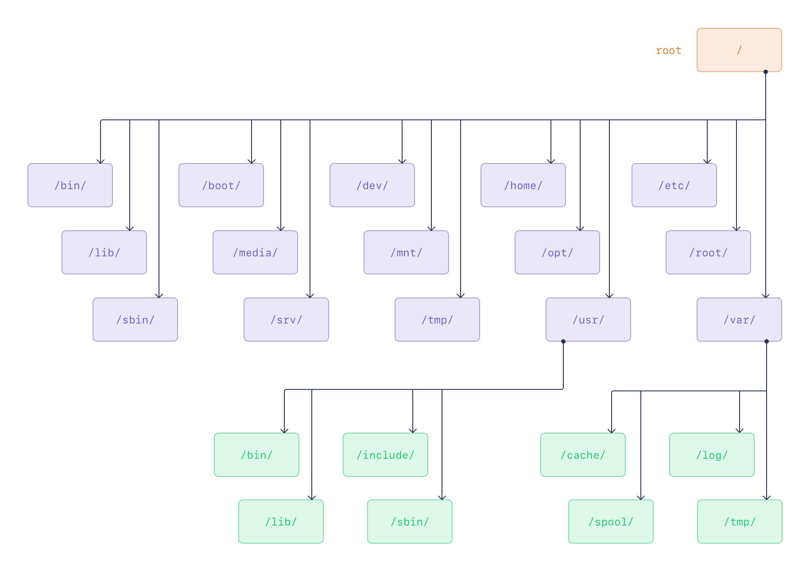

# 3. Linux Filesystem Hierarchy

!!! abstract "Goals"
    Define the Linux Filesystem Hierarchy Standard, explain the Ubuntu filesystem hierarchy, and identify Linux file types.

!!! note
    All actionable Chapter 3 commands were validated on the LAB HOST. Directory and device listings vary with host state.

## :material-book-open-page-variant-outline: 3.1 The Filesystem Hierarchy Standard

### :material-application-edit-outline: Directory Structure

The Filesystem Hierarchy Standard (FHS), maintained by the Linux Foundation, defines directory structure and contents for Unix and Unix-like operating systems. It is currently used only by Linux distributions. Under the FHS, all files and directories appear below the root directory `/`, even when stored on different physical or virtual devices.

The root filesystem must be adequate to boot, restore, recover, or repair the system. It should be as small as reasonably possible because it can be mounted from small media, is less prone to corruption after a system crash, and must not contain application-created or application-required files and subdirectories.

To boot, the root filesystem must contain enough software and data to mount other filesystems, including utilities, boot-loader configuration, and essential start-up data. To recover or repair a system, it must provide utilities for an experienced maintainer to diagnose and repair issues and reconstruct a damaged system. To restore a system, it must provide backup restoration utilities.

### :material-application-edit-outline: The `cd` Command

The `cd` command changes the current directory. Its reference syntax is `cd [option] [directory]`.

Without a directory name, `cd` returns the user to the previous current directory, which can toggle between two directories. With a directory name, it changes to that directory. The name can be an absolute pathname, relative to `/`, or a local pathname, relative to the current directory.

Examples using absolute paths include `cd /` and `cd /usr/sbin`.

To change from the current directory into a subdirectory, use `cd` followed by its name, for example `cd gconf` from within `/etc` when that directory is available.

The current directory is represented by `.`, and its parent directory by `..`; use `cd ..` to move to the parent.

A tilde returns to the home directory, where a user's personal files, directories, and programs are found; use `cd ~` to change there.

Other navigation forms include `cd -` to move to the previous directory and `cd ../../` to move two levels up.

## :material-book-open-page-variant-outline: 3.2 Required Root Filesystem Directories



The following directories, or symbolic links to directories, are required in `/`:

```text
/bin     - essential command binaries
/dev     - device files
/etc     - host-specific system configuration
/sbin    - essential system binaries
/usr     - secondary hierarchy
/var     - variable data hierarchy
/boot    - static files of the boot loader
/lib     - essential shared libraries and kernel modules
/media   - mount point for removable media
/mnt     - mount point for mounting a filesystem temporarily
/tmp     - temporary files
```

Modern Linux distributions also include:

```text
/sys     - Kernel system information virtual filesystem
/proc    - Kernel process information virtual filesystem
```

Optional root filesystem directories include:

```text
/home                - User home directories
/lib64 or /lib32     - Essential system libraries
/root                - Home directory for the root user
```

### :material-application-edit-outline: The `/usr` Hierarchy

The second major filesystem section is shareable and should contain only read-only data. Required subdirectories are:

```text
/usr/bin       - Most user commands
/usr/lib       - Libraries
/usr/local     - Local hierarchy
/usr/sbin      - Non-vital system binaries
/usr/share     - Architecture independent data
```

Optional subdirectories include:

```text
/usr/games                  - Games and educational binaries
/usr/include                - Header files included by C programs
/usr/libexec                - Binaries run by other programs
/usr/lib64 or /usr/lib32    - Alternate format libraries
/usr/src                    - Source code
```

### :material-application-edit-outline: The `/var` Hierarchy

The `/var` directory is designed for files that vary in size:

- Spool directories and files
- Administrative and logging data
- Transient files
- Temporary files

Required subdirectories are:

```text
/var/cache     - Application cache data
/var/lib       - Variable state information
/var/local     - Variable data for /usr/local
/var/lock      - Lock files
/var/log       - Log files and directories
/var/opt       - Variable data for /opt
/var/run       - Data relevant to running processes
/var/spool     - Application spool data
/var/tmp       - Temporary files preserved between system reboots
```

### :material-application-edit-outline: The `/etc` Hierarchy

The `/etc` directory maintains many files, including:

```text
/etc/passwd - user database with user information such as username and home directory
/etc/shadow - encrypted file that holds user passwords
/etc/fstab - lists filesystems mounted automatically at startup by mount -a
/etc/group - similar to /etc/passwd, but describes groups instead of users
/etc/inittab - configuration file for init
/etc/mtab - list of currently mounted filesystems
/etc/profile, /etc/bash.rc - files executed by BASH at login or startup
```

### :material-application-edit-outline: 3.2.1 Directory Structure Lab

This lab examines filesystem directories and their contents.

1. Check the current directory, then change to the root directory.

```bash
# Print the current working directory.
pwd
```

??? example "Expected result"
    `/home/ubuntu`

```bash
# Change to the root directory.
cd /
```

??? example "Expected result"
    No output.

2. List the root directory contents and compare them with the preceding directory list.

```bash
# List the root directory contents.
ls
```

??? example "Expected result"
    ```text
    bin                 etc                lib64       opt   sbin                  sys
    bin.usr-is-merged   home               lost+found  proc  sbin.usr-is-merged    tmp
    boot                lib                media       root  snap                  usr
    dev                 lib.usr-is-merged  mnt         run   srv                   var
    ```

3. Change into `/usr`.

```bash
# Change to the /usr directory.
cd /usr
```

??? example "Expected result"
    No output.

4. Inspect the listed `usr` subdirectories.

```bash
# List the /usr/lib directory contents.
ls lib
```

??? example "Expected result"
    Literal excerpt from this LAB HOST; installed packages affect this listing:

    ```text
    apparmor
    apt
    binfmt.d
    byobu
    cloud-init
    command-not-found
    console-setup
    cryptsetup
    dbus-1.0
    dpkg
    ```

```bash
# List the /usr/games directory contents.
ls games
```

??? example "Expected result"
    No output.

```bash
# List the /usr/local directory contents.
ls local
```

??? example "Expected result"
    ```text
    bin  etc  games  include  lib  man  sbin  share  src
    ```

5. Change back to `/`, then change to `/var`.

```bash
# Change to the root directory.
cd /
```

??? example "Expected result"
    No output.

```bash
# Change to the /var directory.
cd /var
```

??? example "Expected result"
    No output.

6. Inspect the `var` subdirectory listed on the preceding page.

```bash
# List the /var/cache directory contents.
ls cache
```

??? example "Expected result"
    ```text
    PackageKit  apparmor  fwupd       man        private
    adduser     apt       fwupdmgr    motd-news  snapd
    app-info    debconf   ldconfig    pollinate  swcatalog
    ```

7. Change to the `cache` subdirectory, then move two directories up.

```bash
# Change to the cache subdirectory.
cd cache
```

??? example "Expected result"
    No output.

```bash
# Move two directories up from the current directory.
cd ../../
```

??? example "Expected result"
    No output.

8. Change to the home directory.

```bash
# Change to the current user's home directory.
cd ~
```

??? example "Expected result"
    No output.

9. Install `tree`, then run it from the home directory.

```bash
# Install the tree package without an interactive confirmation prompt.
sudo apt install tree -y
```

??? example "Expected result"
    Literal excerpt; package-manager progress and follow-up maintenance output vary by host state:

    ```text
    The following NEW packages will be installed:
      tree
    0 upgraded, 1 newly installed, 0 to remove and 261 not upgraded.
    Need to get 47.4 kB of archives.
    After this operation, 111 kB of additional disk space will be used.
    Get:1 http://archive.ubuntu.com/ubuntu noble-updates/universe amd64 tree amd64 2.1.1-2ubuntu3.24.04.2 [47.4 kB]
    Setting up tree (2.1.1-2ubuntu3.24.04.2) ...
    ```

```bash
# Change to the current user's home directory.
cd ~
```

??? example "Expected result"
    No output.

```bash
# Display the home directory in a tree-like format.
tree
```

??? example "Expected result"
    Literal excerpt from this LAB HOST. The full listing contained 13,576 lines and varies with home-directory contents:

    ```text
    .
    ├── 2014-00
    ├── 2014-01
    ├── 2014-02
    ├── 2014-03
    ├── 2014-04
    ├── 2014-05
    ├── 2014-06
    ├── 2014-07
    ├── 2014-08
    ```

10. List `/` with `tree` and inspect it.

```bash
# Display one level of the root directory tree.
tree -L 1 /
```

??? example "Expected result"
    ```text
    /
    ├── bin -> usr/bin
    ├── bin.usr-is-merged
    ├── boot
    ├── dev
    ├── etc
    ├── home
    ├── lib -> usr/lib
    ├── lib.usr-is-merged
    ├── lib64 -> usr/lib64
    ├── lost+found
    ├── media
    ├── mnt
    ├── opt
    ├── proc
    ├── root
    ├── run
    ├── sbin -> usr/sbin
    ├── sbin.usr-is-merged
    ├── snap
    ├── srv
    ├── sys
    ├── tmp
    ├── usr
    └── var

    25 directories, 0 files
    ```

11. Go one level deeper and inspect it.

```bash
# Display two levels of the root directory tree.
tree -L 2 /
```

??? example "Expected result"
    Literal excerpt from this LAB HOST. The full listing contained 696 lines and varies with installed kernels and host state:

    ```text
    /
    ├── bin -> usr/bin
    ├── bin.usr-is-merged
    ├── boot
    │   ├── System.map-6.8.0-138-generic
    │   ├── System.map-6.8.0-53-generic
    │   ├── config-6.8.0-138-generic
    │   ├── config-6.8.0-53-generic
    │   ├── efi
    │   ├── grub
    │   ├── initrd.img -> initrd.img-6.8.0-138-generic
    │   ├── initrd.img-6.8.0-138-generic
    │   ├── initrd.img-6.8.0-53-generic
    │   └── initrd.img.old -> initrd.img-6.8.0-53-generic
    ```

> End of the lab. Do not continue with the next topic.

## :material-book-open-page-variant-outline: 3.3 Linux File Types

### :material-application-edit-outline: Determining File Types

Use `ls` to determine a file type.

```bash
# List detailed information for /etc/hosts.
ls -l /etc/hosts
```

??? example "Expected result"
    ```text
    -rw-r--r-- 1 root root 221 Feb 14  2025 /etc/hosts
    ```

The first character in the output, `-` in this example, indicates the file type. Linux file types are:

| Type | Symbol | Description |
| --- | :---: | --- |
| regular | `-` | Any file that is not a directory or special file type. |
| directory | `d` | The second-most common file type. |
| socket | `s` | Provides inter-process communication. |
| block | `b` | A device file that communicates with a driver in the kernel. |
| link | `l` | A pointer to another file; can be a soft or hard link. |
| named pipe | `p` | Similar to sockets; provides IPC without network sockets. |
| character | `c` | A device file that communicates with a driver in the kernel. |

A `regular file` is not a directory or special file type. Regular files include binaries or libraries, configuration files, image files, audio or video files, data files, and tar files.

A `directory` is the second-most common file type. It organizes other file types and is essentially a file that lists other files.

A `socket` provides inter-process communication. When it has a filename, it can be accessed through the filesystem. TCP/IP sockets can be accessed over the network.

A `block file` communicates with a kernel driver, which usually communicates with hardware. Data flow is buffered. Block files are used with block storage devices such as disks or memory. Examples include `/dev/sda` and `/dev/ram0`.

A `pipe` is similar to a socket and lets processes communicate without network socket semantics; the processes do not need to be designed to work together.

A `character` file communicates with a kernel driver, which usually communicates with hardware. Data flow is unbuffered: each character is consumed when written and read when provided. Keyboard and mouse files are examples. Character special files include `/dev/ttyS0` and `/dev/console`.

### :material-application-edit-outline: 3.3.1 File Types Lab

This lab examines file types.

1. Run the following commands and identify the file types.

```bash
# List detailed information for the /etc directory.
ls -ld /etc
```

??? example "Expected result"
    ```text
    drwxr-xr-x 106 root root 4096 Aug 25 06:14 /etc
    ```

```bash
# List detailed information for /etc/hosts.
ls -l /etc/hosts
```

??? example "Expected result"
    ```text
    -rw-r--r-- 1 root root 221 Feb 14  2025 /etc/hosts
    ```

```bash
# List detailed information for the controlling terminal.
ls -l /dev/tty
```

??? example "Expected result"
    ```text
    crw-rw-rw- 1 root tty 5, 0 Aug 25 07:46 /dev/tty
    ```

```bash
# List detailed information for the vda block device.
ls -l /dev/vda
```

??? example "Expected result"
    ```text
    brw-rw---- 1 root disk 253, 0 Aug 25 06:55 /dev/vda
    ```

2. Inspect the many file types in `/dev`.

```bash
# List detailed information for device files.
ls -l /dev/
```

??? example "Expected result"
    Literal excerpt from this LAB HOST; device entries and timestamps vary by host state:

    ```text
    total 0
    crw-r--r-- 1 root root     10, 235 Aug 25 06:55 autofs
    drwxr-xr-x 2 root root         340 Aug 25 06:55 block
    crw-rw---- 1 root disk     10, 234 Aug 25 06:55 btrfs-control
    drwxr-xr-x 3 root root          60 Aug 25 06:55 bus
    drwxr-xr-x 2 root root        3300 Aug 25 06:55 char
    crw--w---- 1 root tty       5,   1 Aug 25 06:56 console
    lrwxrwxrwx 1 root root          11 Aug 25 06:55 core -> /proc/kcore
    ```

3. Create a file and inspect its type.

```bash
# Create an empty regular file.
touch file1.txt
```

??? example "Expected result"
    No output.

```bash
# List detailed information for the new file.
ls -l file1.txt
```

??? example "Expected result"
    ```text
    -rw-rw-r-- 1 ubuntu ubuntu 0 Aug 25 07:50 file1.txt
    ```

4. Create a directory and inspect it.

```bash
# Create a directory named dirone.
mkdir dirone
```

??? example "Expected result"
    No output.

```bash
# List the dirone directory entry.
ls -l | grep dirone
```

??? example "Expected result"
    ```text
    drwxrwxr-x 2 ubuntu ubuntu 4096 Aug 25 07:50 dirone
    ```

5. Remove the file and directory.

```bash
# Remove the empty dirone directory.
rmdir dirone/
```

??? example "Expected result"
    No output.

```bash
# Remove the file1.txt file.
rm file1.txt
```

??? example "Expected result"
    No output.

> End of the lab. Do not continue with the next topic.
