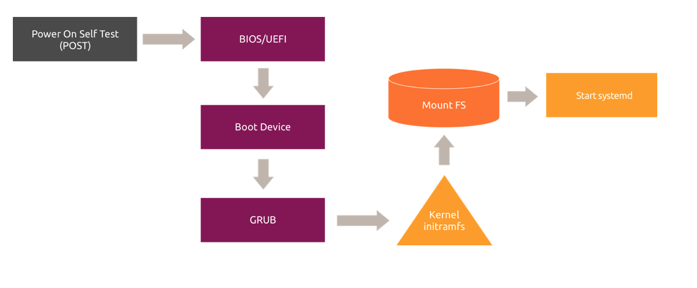

# 5. Logging and Initialization

!!! abstract
    Inspect system logs, understand boot initialization, and manage systemd units.

!!! note
    Replacement-LABVM validation captured all results except the direct SSH journal query, whose output remains pending because no safe literal excerpt can be published. `sudo` is required for the logrotate status-file and kernel-message commands.

## :material-book-open-page-variant-outline: 5.1 System Logging

Logging records normal operation, state changes, diagnostics, kernel and network events, authentication, user actions, and exceptions. Logs are a first troubleshooting step and support security monitoring. Ubuntu commonly writes local logs under `/var/log/` through `rsyslogd`, including `/var/log/kern.log`, `/var/log/syslog`, and `/var/log/auth.log`. Systems can also send logs to a remote collector.

Search a log by source or severity:

```bash
# Search syslog for NetworkManager entries
grep NetworkManager /var/log/syslog
```
??? example "Expected result"
    No output. The command returned exit status 1 because no matching `NetworkManager` entry was present.

```bash
# Search syslog for errors without case sensitivity
grep -i "error" /var/log/syslog
```
??? example "Expected result"
    `error`

    Safe literal excerpt from a matching current log entry; log contents vary.

```bash
# List per-application logrotate rules
ls /etc/logrotate.d/
```
??? example "Expected result"
    ```text
    alternatives
    apport
    apt
    bootlog
    btmp
    cloud-init
    dpkg
    rsyslog
    ubuntu-pro-client
    ufw
    unattended-upgrades
    wtmp
    ```

```bash
# Run log rotation using the main configuration
sudo logrotate /etc/logrotate.conf
```
??? example "Expected result"
    No output.

The main configuration is `/etc/logrotate.conf`. Its options and the example configuration in the source are reference material; configuration content is host-specific and is not presented as a command result.

```bash
# Inspect logrotate history with required privilege
sudo cat /var/lib/logrotate/status
```
??? example "Expected result"
    `logrotate state -- version 2`

```bash
# Force verbose log rotation for troubleshooting
sudo logrotate -vf /etc/logrotate.conf
```
??? example "Expected result"
    `reading config file /etc/logrotate.conf`

### :material-application-edit-outline: 5.1.1 System Logging Lab

```bash
# Display kernel messages with required privilege
sudo dmesg
```
??? example "Expected result"
    `[    1.861209] virtio_blk virtio1: [vda] 7340032 512-byte logical blocks (3.76 GB/3.50 GiB)`

```bash
# Page through kernel messages with required privilege
sudo dmesg | less
```
??? example "Expected result"
    The pager opened and closed with `q`.

```bash
# Find vda device messages with required privilege
sudo dmesg | grep -i vda
```
??? example "Expected result"
    `[    1.861209] virtio_blk virtio1: [vda] 7340032 512-byte logical blocks (3.76 GB/3.50 GiB)`

```bash
# Save vda messages to a file with required privilege
sudo dmesg | grep vda > vda.txt
```
??? example "Expected result"
    No output. `vda.txt` was created and removed after validation.

```bash
# Search syslog for errors
grep error /var/log/syslog
```
??? example "Expected result"
    No output. The command returned exit status 1 because no lowercase `error` entry was present.

```bash
# Show the first ten syslog lines
head -n 10 /var/log/syslog
```
??? example "Expected result"
    `rsyslogd`

    Safe literal excerpt from the current first-ten-lines output; log contents vary.

```bash
# Show the last ten syslog lines
tail -n 10 /var/log/syslog
```
??? example "Expected result"
    `systemd`

    Safe literal excerpt from the current last-ten-lines output; log contents vary.

```bash
# List available log files
ls -l /var/log
```
??? example "Expected result"
    `-rw-r-----  1 syslog    adm                3624 Aug 28 15:32 auth.log`

## :material-book-open-page-variant-outline: 5.2 Boot Process Overview

Firmware starts first, then GRUB transfers control to the operating system. The initrd prepares required hardware and drivers before the real root filesystem is available. The kernel manages system resources, and Ubuntu Server 24.04 uses systemd as its init system.



### :material-application-edit-outline: 5.2.1 Boot Process Lab

```bash
# List boot files
ls -l /boot/
```
??? example "Expected result"
    `drwxr-xr-x 6 root root     4096 Aug 27 19:24 grub`

## :material-book-open-page-variant-outline: 5.3 Systemd

systemd is the default init system. It manages units and their dependencies. Unit definitions reside in `/etc/systemd/system` or `/lib/systemd/system`.

### :material-application-edit-outline: 5.3.1 Systemd Lab

```bash
# Read the systemctl manual
man systemctl
```
??? example "Expected result"
    The pager opened and closed with `q`.

```bash
# Stop the cron service
sudo systemctl stop cron
```
??? example "Expected result"
    No output.

```bash
# Inspect stopped cron service status
sudo systemctl status cron
```
??? example "Expected result"
    `inactive (dead)`

    The inactive status returned exit status 3.

```bash
# Start the cron service
sudo systemctl start cron
```
??? example "Expected result"
    No output.

```bash
# Inspect running cron service status
sudo systemctl status cron
```
??? example "Expected result"
    `active (running)`

```bash
# List service units
systemctl list-units -t service
```
??? example "Expected result"
    ```text
    UNIT LOAD ACTIVE SUB DESCRIPTION
    ssh.service loaded active running OpenBSD Secure Shell server
    ```

```bash
# Show running SSH services
systemctl list-units -t service | grep -i ssh
```
??? example "Expected result"
    `ssh.service loaded active running OpenBSD Secure Shell server`

```bash
# List failed units
systemctl --failed
```
??? example "Expected result"
    `UNIT LOAD ACTIVE SUB DESCRIPTION`

```bash
# Read the journalctl manual
man journalctl
```
??? example "Expected result"
    The pager opened and closed with `q`.

```bash
# Query the SSH journal
journalctl -u ssh.service
```
??? example "Expected result"
    Validation pending; no captured output is available.

```bash
# Show SSH service properties
systemctl show ssh.service
```
??? example "Expected result"
    `Id=ssh.service`

```bash
# Restart the SSH service
sudo systemctl restart ssh
```
??? example "Expected result"
    No output. A fresh separate connection confirmed `ssh.service` was active after the restart.
