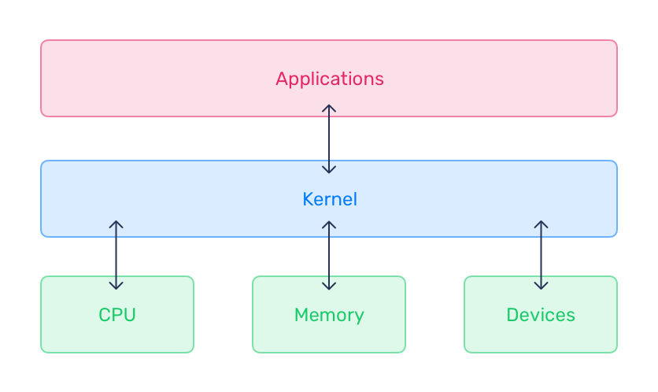
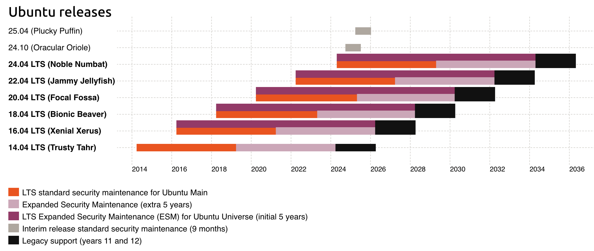

# 1. What is Ubuntu

!!! abstract "Goals"
    Differentiate Ubuntu flavours, explain the release cycle and naming convention, and describe the LTS maintenance cycle.

!!! note
    Commands in this chapter were validated on the LAB HOST on 2026-08-24.

Connect to the `STUDENT HOST` using the public IP and credentials provided for the lab. Then connect to the `LAB HOST` to run the commands in subsequent chapters.

```bash
# Connect to the lab host.
ssh ubuntu@192.168.100.4
```

??? example "Expected result"
    Welcome to Ubuntu 24.04.2 LTS (GNU/Linux 6.8.0-53-generic x86_64)

    Welcome text and the shell prompt can differ between lab sessions. Authentication prompts are not shown.

## :material-book-open-page-variant-outline: 1.1 What Is Linux?

Linux began as a clone of MINIX, a Unix-like system intended for academic use. It evolved into the Linux kernel, created and released by Linus Torvalds in 1991 as a free and later open-source alternative to MINIX and other UNIX-like systems with restrictions on modification and redistribution.

Linux is also commonly used to mean an operating system: a set of programs, tools, and services bundled with the Linux kernel to provide the components of an operating system.

Linux is the largest and most widespread open-source software project. The Linux Foundation fosters kernel development. Linux runs on systems from embedded devices to supercomputers. Examples from the source material include:

- 95% of domains use Linux as the operating system.
- 80% of smartphones run Android, which is based on the Linux kernel.
- 98% of the 500 fastest supercomputers run Linux.
- 75% of cloud-enabled enterprises use Linux as the primary cloud platform.
- NYSE, NASDAQ, the London Exchange, and the Tokyo Stock Exchange run on Linux.
- Most consumer electronic devices use Linux because of its small footprint.
- Amazon, Ebay, Paypal, Walmart, and others use Linux.

Linux is also widely used for the Internet of Things (IoT), cloud computing, and big data.

## :material-book-open-page-variant-outline: 1.2 What Is the Kernel?

The Linux kernel is at the core of Ubuntu. It manages hardware resources including I/O devices, memory, and CPU. It is one of the first programs loaded during boot and provides a hardware environment in which user-space and application programs can run across different platforms without needing to know the underlying system in detail.

More information is available at <https://kernel.org/>.

The kernel controls CPU, memory, inter-process communication, device drivers, filesystem management, and system calls. Because it manages hardware and multitasking, it can provide processes with information from memory or other processes and enable communication between processes.

The Linux kernel is monolithic: device drivers, filesystems, and application inter-process communication operate in kernel space. The kernel defines the high-level virtual interface over hardware. System calls provide OS services such as process management, concurrency, and memory management. Device drivers can be added as modules.

Linux supports true preemptive multitasking, virtual memory, shared libraries, demand loading, shared copy-on-write executables, memory management, the Internet protocol suite, and threading.

The kernel is written in C and assembly language by contributors worldwide. Development discussion is available through the Linux Kernel Mailing List (LKML).

The kernel runs in kernel mode; user processes run in user mode. Kernel-mode code has unrestricted processor and main-memory access. Most software runs in user space and interfaces with the kernel to perform tasks.

Included modules and kernel configuration determine a kernel's functionality for its hardware and expected workloads. Kernel modules are binary programs that extend hardware control or add capabilities such as high-performance networking or non-standard graphics. The default `GA` kernel shipped with Canonical Ubuntu LTS and Hardware Enablement (`HWE`) releases is tuned for stable, reliable, secure, high-performance operation across varied hardware and workloads.



## :material-book-open-page-variant-outline: 1.3 What Is Ubuntu?

Ubuntu is a Linux distribution based on Debian that runs on platforms from IoT to the cloud.

Ubuntu release names use a two-digit year and two-digit release month. For example, Ubuntu 24.04 was released in April 2024 and Ubuntu 23.10 was released in October 2023. Releases also have an `Adjective Animal` code name: Ubuntu 24.04 is `Noble Numbat`, and Ubuntu 24.10 is `Oracular Oriole`.

## :material-book-open-page-variant-outline: 1.4 The Release Cycle

LTS (`Long Term Support`) releases are published every two years in April. They are Ubuntu's enterprise-grade releases and are the most widely used; the source estimates that 95% of Ubuntu installations use LTS releases.

Canonical publishes an interim release every six months between LTS versions. Ubuntu 24.10 is an example. Interim releases are production-quality and supported for nine months, allowing time to update, but they do not have the long-term commitment of LTS releases.



Interim releases introduce new capabilities from Canonical and upstream open-source projects and act as a proving ground. Developers may use them for newer compilers, kernels, and libraries, including in rapid DevOps processes such as CI/CD where an artifact may have a shorter lifespan than the interim support period. Interim releases receive full security maintenance for `main` during their lifespan.

For more information, visit <http://www.ubuntu.com>.

## :material-book-open-page-variant-outline: 1.5 Ubuntu Lab

1. Check the Ubuntu distribution version.

```bash
# Display operating system release metadata.
cat /etc/os-release
```

??? example "Expected result"
    PRETTY_NAME="Ubuntu 24.04.2 LTS"
    NAME="Ubuntu"
    VERSION_ID="24.04"
    VERSION="24.04.2 LTS (Noble Numbat)"
    VERSION_CODENAME=noble
    ID=ubuntu
    ID_LIKE=debian
    HOME_URL="https://www.ubuntu.com/"
    SUPPORT_URL="https://help.ubuntu.com/"
    BUG_REPORT_URL="https://bugs.launchpad.net/ubuntu/"
    PRIVACY_POLICY_URL="https://www.ubuntu.com/legal/terms-and-policies/privacy-policy"
    UBUNTU_CODENAME=noble
    LOGO=ubuntu-logo

Another way to check the Ubuntu distribution version is:

```bash
# Display legacy Ubuntu release metadata when the file is present.
cat /etc/lsb-release
```

??? example "Expected result"
    DISTRIB_ID=Ubuntu
    DISTRIB_RELEASE=24.04
    DISTRIB_CODENAME=noble
    DISTRIB_DESCRIPTION="Ubuntu 24.04.2 LTS"

2. Check the kernel version.

```bash
# Display kernel and system information.
uname -a
```

??? example "Expected result"
    Linux ubuntu 6.8.0-53-generic #55-Ubuntu SMP PREEMPT_DYNAMIC Fri Jan 17 15:37:52 UTC 2025 x86_64 x86_64 x86_64 GNU/Linux

    The kernel version, build timestamp, and system architecture can differ between lab images.

Another way to check the kernel version is:

```bash
# Display Ubuntu's kernel version signature.
cat /proc/version_signature
```

??? example "Expected result"
    Ubuntu 6.8.0-53.55-generic 6.8.12

    The package and upstream kernel versions can differ between lab images.

> End of the lab. Do not continue with the next topic.
